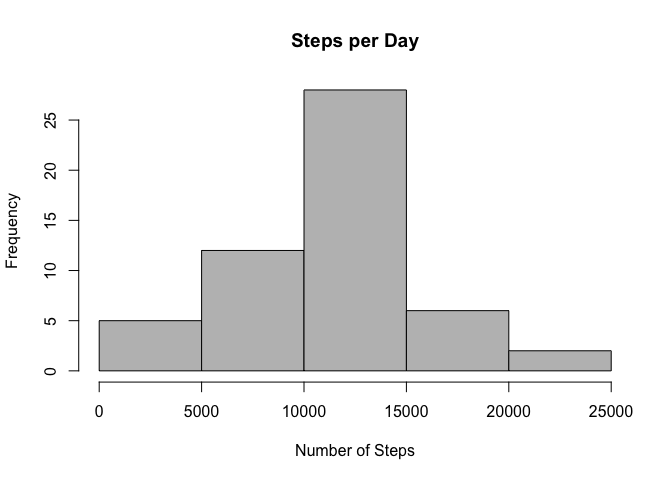
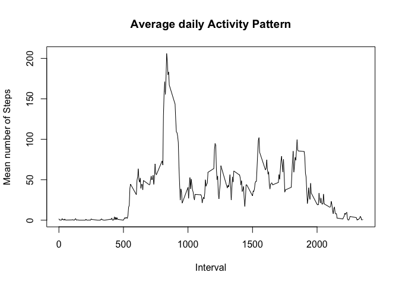
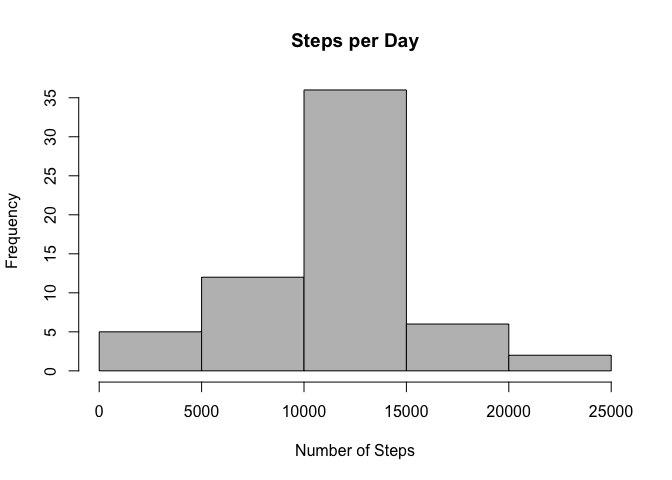
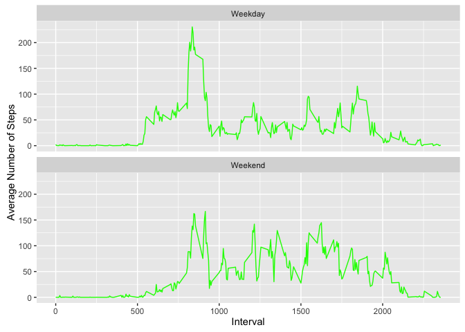

# ActivityMonitoring
Ignacio Rodriguez Solis  
30 de julio de 2016  

# Setting default global options

In this document, the global options are echo = TRUE, results = Hold:

```r
library(knitr)
knitr::opts_chunk$set(echo = TRUE, results = "hold")
```

# Assignment

This assignment requires the generation of a single R Markdown document containing the analysis of some activity monitoring data included in a csv file.


## Loading and preprocessing the data

This first question of the assignment consists of the code for reading in and/or processing the data. I am only going to read the data the first time, so here the cache option equals True. The csv file is located in the same place as the Rmd file:


```r
activityFile <- "activity.csv"
activityData <- read.csv(activityFile, header = TRUE)
activityData$date <- as.Date(as.character(activityData$date),"%Y-%m-%d")
```

Once the file is read and loaded into a dataset, I am taking a look at the first values and its summary:


```r
head(activityData, 10)
summary(activityData)
```

```
##    steps       date interval
## 1     NA 2012-10-01        0
## 2     NA 2012-10-01        5
## 3     NA 2012-10-01       10
## 4     NA 2012-10-01       15
## 5     NA 2012-10-01       20
## 6     NA 2012-10-01       25
## 7     NA 2012-10-01       30
## 8     NA 2012-10-01       35
## 9     NA 2012-10-01       40
## 10    NA 2012-10-01       45
##      steps             date               interval     
##  Min.   :  0.00   Min.   :2012-10-01   Min.   :   0.0  
##  1st Qu.:  0.00   1st Qu.:2012-10-16   1st Qu.: 588.8  
##  Median :  0.00   Median :2012-10-31   Median :1177.5  
##  Mean   : 37.38   Mean   :2012-10-31   Mean   :1177.5  
##  3rd Qu.: 12.00   3rd Qu.:2012-11-15   3rd Qu.:1766.2  
##  Max.   :806.00   Max.   :2012-11-30   Max.   :2355.0  
##  NA's   :2304
```


## What is mean total number of steps taken per day?

Missing values in the dataset can be ignored.


### 1. Calculate the total number of steps taken per day

To obtain the answer, first I calculate the sum (the total number) of steps taken per day with the function aggregate and removing the NA values with na.rm = True. I check the first values of the new variable to see everything is in order:


```r
StepsperDay <- aggregate(steps~date, activityData, sum, na.rm = TRUE)
head(StepsperDay, 10)
```

```
##          date steps
## 1  2012-10-02   126
## 2  2012-10-03 11352
## 3  2012-10-04 12116
## 4  2012-10-05 13294
## 5  2012-10-06 15420
## 6  2012-10-07 11015
## 7  2012-10-09 12811
## 8  2012-10-10  9900
## 9  2012-10-11 10304
## 10 2012-10-12 17382
```


### 2. Make a histogram of the total number of steps taken each day

To obtain the histogram I am going to use the function hist:


```r
hist(x = StepsperDay$steps, col = "grey", main = "Steps per Day", xlab = "Number of Steps")
```

<!-- -->


### 3. Calculate and report the mean and median of the total number of steps taken per day

First, I calculate the mean of the steps values in StepsperDay:


```r
meanSteps <- mean(StepsperDay$steps)
meanSteps
```

```
## [1] 10766.19
```

And then, I calculate the median of the steps values in StepsperDay:


```r
medianSteps <- median(StepsperDay$steps)
medianSteps
```

```
## [1] 10765
```


## What is the average daily activity pattern?

### 1. Make a time series plot (i.e. type = "l") of the 5-minute interval (x-axis) and the average number of steps taken, averaged across all days (y-axis)

First, I have to calculate the steps per interval by calculating the mean number of steps for each of the five-minute interval:


```r
intervalSteps <- aggregate(steps~interval, activityData, mean, na.rm = TRUE)
head(intervalSteps, 10)
```

```
##    interval     steps
## 1         0 1.7169811
## 2         5 0.3396226
## 3        10 0.1320755
## 4        15 0.1509434
## 5        20 0.0754717
## 6        25 2.0943396
## 7        30 0.5283019
## 8        35 0.8679245
## 9        40 0.0000000
## 10       45 1.4716981
```

Then I plot the results using the function plot:


```r
plot(intervalSteps, type = "l", ylab = "Mean number of Steps", xlab = "Interval", main = "Average daily Activity Pattern")
```

<!-- -->

### 2. Which 5-minute interval, on average across all the days in the dataset, contains the maximum number of steps?

To find the 5-minute interval containing, on average, the maximum number of steps, I use the function which.max:


```r
intervalMaxSteps <- intervalSteps[which.max(intervalSteps$steps),]
intervalMaxSteps
```

```
##     interval    steps
## 104      835 206.1698
```


## Imputing missing values

There is a number of days/intervals where there are missing values (coded as NA). The presence of missing days may introduce bias into some calculations or summaries of the data.

### 1. Calculate and report the total number of missing values in the dataset (i.e. the total number of rows with NAs).

To do this, I sum the number of NAs in the step values like this:


```r
naSteps <- sum(is.na(activityData))
naSteps
```

```
## [1] 2304
```

### 2. Devise a strategy for filling in all of the missing values in the dataset. The strategy does not need to be sophisticated. For example, you could use the mean/median for that day, or the mean for that 5-minute interval, etc.

The goal is to replace the missing values with estimated ones. Since each of the observation corresponds to an interval, I will replace the NA values with the expected ones for those missing intervals. To do so, I will fill those missing values with the interval means.

### 3. Create a new dataset that is equal to the original dataset but with the missing data filled in.

I am going to create this new dataset with the missing data filled in by following the strategy explained in the previous question:


```r
avSteps <- aggregate(steps~interval, activityData, mean)
steps <- numeric()
for (i in 1:nrow(activityData)) {
    blanks <- activityData[i,]
    if (is.na(blanks$steps)) {
        newSteps <- subset(avSteps, interval == blanks$interval)$steps
    }
    else {
        newSteps <- blanks$steps
    }
    steps <- c(steps,newSteps)
}
activityData2 <- cbind(activityData[,-1], steps)
```

Now, I am going to check that the new dataset has no missing values. First I am going to oversee its first values and then check if there are any missing values:


```r
head(activityData2, 10)
sum(is.na(activityData2$steps))
```

```
##          date interval     steps
## 1  2012-10-01        0 1.7169811
## 2  2012-10-01        5 0.3396226
## 3  2012-10-01       10 0.1320755
## 4  2012-10-01       15 0.1509434
## 5  2012-10-01       20 0.0754717
## 6  2012-10-01       25 2.0943396
## 7  2012-10-01       30 0.5283019
## 8  2012-10-01       35 0.8679245
## 9  2012-10-01       40 0.0000000
## 10 2012-10-01       45 1.4716981
## [1] 0
```

### 4. Make a histogram of the total number of steps taken each day and Calculate and report the mean and median total number of steps taken per day. Do these values differ from the estimates from the first part of the assignment? What is the impact of imputing missing data on the estimates of the total daily number of steps?

To obtain the new histogram I am going to calculate a new variable StepsperDay2, based on activityData2, and use the function hist again:


```r
StepsperDay2 <- aggregate(steps~date, activityData2, sum)
hist(x = StepsperDay2$steps, col = "grey", main = "Steps per Day", xlab = "Number of Steps")
```

<!-- -->

Then I am going to calculate the new mean and median for activityData2:


```r
meanSteps2 <- mean(StepsperDay2$steps)
meanSteps2
```

```
## [1] 10766.19
```


```r
medianSteps2 <- median(StepsperDay2$steps)
medianSteps2
```

```
## [1] 10766.19
```

The values do not differ significantly from the estimates from the first part of the assignment. The mean remains the same, the median has slightly shifted by one point, from 10765 to 10766. Imputing the missing data on the estimates of the total daily number of steps has increased the peak of the second histogram, compared to the first one, although the distribution remains almost the same, and it does not impact negatively on predictions.


## Are there differences in activity patterns between weekdays and weekends?

In this section I am going to study if there are any differences in patterns between weekdays and weekends. To do so, I am going to use the dataset with no NA values.

### 1. Create a new factor variable in the dataset with two levels – “weekday” and “weekend” indicating whether a given date is a weekday or weekend day.

To create this new factor variable I am going to use the weekdays function:


```r
stepDays <- weekdays(activityData2$date)
for (j in 1:length(stepDays)) {
    if (stepDays[j] %in% c("sábado","domingo")) {
        stepDays[j] = "Weekend"
    }
    else {
        stepDays[j] = "Weekday"
    }
}
activityData2$day <- as.factor(stepDays)
```

### 2. Make a panel plot containing a time series plot (i.e. type = "l") of the 5-minute interval (x-axis) and the average number of steps taken, averaged across all weekday days or weekend days (y-axis).

To make the panel plot, I calculate the agreggated mean, the same as it was done in a previous question of the assignment, but distinguishing weekdays from weekend, using the new factor variable. Then, I plot the resulting panel:


```r
library(ggplot2)
intervalWeekSteps <- aggregate(steps~day + interval, activityData2, mean)
ggplot(intervalWeekSteps, aes(x = interval, y = steps)) + 
        geom_line(color = "green") + 
        facet_wrap( ~ day, nrow = 2, ncol = 1) + 
        labs(x = "Interval", y = "Average Number of Steps")
```

<!-- -->

As shown in the plot, there are differences in the patterns between weekdays and weekends due to the differences in behaviour between weekdays, which include all the working hours and weekends, when the individual has more free time to dedicate to other activities. During weekdays, and although there is a significant peak of activity, the rest of the interval show relatively low activity patterns. On the other hand, on weekends, the activity pattern is sustainedly higher throughout the weekend intervals.
